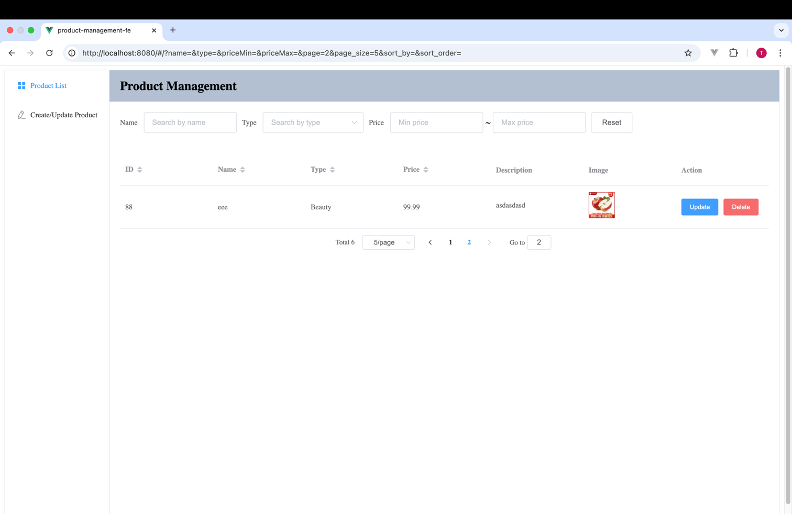

# Product Management Application

This repository contains the implementation of a full-stack application for product management with a frontend built using Vue.js and a backend powered by Go (Golang) and the Gin framework.
The directories product-management-fe and product-management-be are both managed by **Git**

### Tech stack:
- **Frontend**: JavaScript, Vue.js, Vue Router, Vuex, ElementUI
- **Backend**: Golang, Gin, Gorm
- **Database**: PostgreSQL
- **Local Deployment**: Docker, DockerCompose
- **Version Control**: Git

## Features Implemented
1. Product Creation
2. Product Update
3. Product Deletion
4. Product List (including filtering and sorting)

The full API documentation is in `./product_management_be/readme.md`

   
## Setup and Installation

### Prerequisites
Docker and Docker Compose must be installed on your machine.

### Steps to Run Locally

1. **Start Services**:
``` bash
docker-compose up --build
```
2. **Create Database and Index (if it's the first time you run the app)**
``` bash
docker exec -i product_management_db psql -U postgres -d postgres -f /custom-scripts/init.sql
```
3. **Visit Our Frontend**

visit http://localhost:8080
4. **Stop the Application**
```bash
docker-compose down
```

## Feature Demonstration
### initial empty list

### product creation page

#### form validation

#### form complete

#### product creation success

#### image preview

### click "update" on one item
#### update page (reuse the creation page, but have a query parameter id)

#### change the price, description and image

#### update result

### show full description by hovering on it

### click "delete" on one item
#### deletion confirmation

### delete result

### more products in the list

#### change from 10/page to 5/page

#### change page number

### search products by filters


### order by price desc

### order by name asc

### enter the url with filters and pagination directly
enter `http://localhost:8080/#/?name=a&type=Beauty&priceMin=&priceMax=&page=1&page_size=5` in a new page

and it will show the below page and fill the search form and pagination automatically

